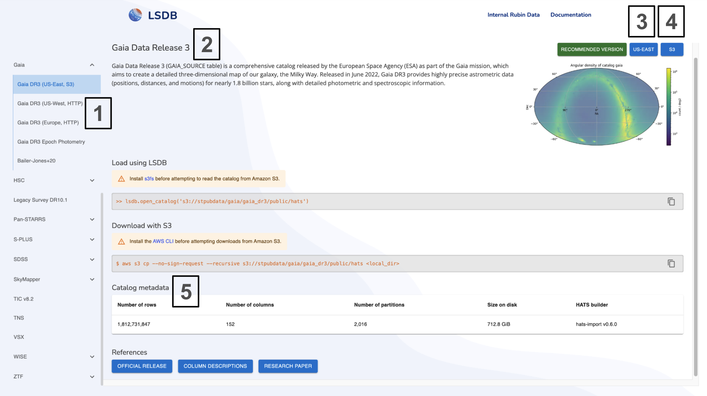

Data Access via data.lsdb.io
========================================================================================

This page walks through the `data.lsdb.io <https://data.lsdb.io/>`__ site and explains how the information on that page maps to where catalogs live and how you can access them.

At `data.lsdb.io <https://data.lsdb.io/>`__ we provide information about all catalogs that are served by LINCC Frameworks, Space Telescope Science Institute (STScI), IPAC/IRSA, and the select catalogs from Centre de Données astronomiques de Strasbourg (CDS). Further public catalogs are avaliable - see the :doc:`external data centers <external>` page for more information. Additionally, HATS catalogs for data products from Rubin Observatory are available via mutliple access points described in the :doc:`Rubin LSDB Access </tutorials/pre_executed/rubin_dp1>` page.

data.lsdb.io Layout
----------------------------------------------------------------------------------------

   data.lsdb.io page layout with numbered callouts for key sections.

Let's consider the example Figure above and explain briefly the numbered callouts which map to these sections:

1. **Catalog list:** the left sidebar that lets you browse catalogs and releases. If there are multiple providers of a given catalog, they will be grouped under the same catalog name, with different hosting regions and access methods indicated.
2. **Catalog overview:** the title and description for the selected catalog, including the simplest way on how to access the data through LSDB and how to  download directly.
3. **Region description:** describes the hosting region (for example, ``US-EAST``). See discussion below for details of various options.
4. **Access type:** describes the access path, which are either ``S3`` or ``HTTP`` endpoints. See discussion below for details and more information is available in the :doc:`remote data access page <remote_data>`.
5. **Catalog metadata:** summary table showing the number of rows, columns, partitions, size on disk and which version of HATS builder or pipeline was used to create the catalog. See discussion about versioning below for details.

Region description and access type
----------------------------------------------------------------------------------------

The region tabs (for example, ``US-EAST`` or ``Europe``) indicate the hosting region for that catalog copy. Which provider is the fastest for you will depend on number of factors, including your geographic location, network conditions, and whether you are accessing via ``HTTP`` or ``S3`` protocols.

Below are details about each provider: 

``US-WEST & HTTP``: These datasets are hosted at University of Washington (UW) on static HTTP/S endpoints. They are accessible globally, but speed might be limited due to limited bandwidth that is avaliable from UW servers.

``US-EAST & S3``: These datasets are hosted in Amazon Web Services (AWS) S3 buckets in the US East region, provided by Space Telescope Science Institute (STScI). They can be accessed via ``s3://`` URLs, and should provided better performance due to robust cloud infrastructure.

``US-WEST & S3``: These datasets are hosted in Amazon Web Services (AWS) S3 buckets in the US West region, provided by IPAC/IRSA. They can also be accessed via ``s3://`` URLs, and should provide better performance due to robust cloud infrastructure.

``Europe & HTTP``: These datasets are hosted at the Centre de Données astronomiques de Strasbourg (CDS) in Europe on static HTTP/S endpoints. They are using experimental HATS-on-the-fly serving infrastructure. More information is avaliable at :doc:`External providers page <external>`.

Catalog Metadata - Version
----------------------------------------------------------------------------------------

The version indicates which version of the HATS builder or pipeline was used to create the catalog. This should enable you understand which features are available in the catalog. In particular, hats builder versions >= 0.6.0 support catalog collections, which changes how the auxiliary data is accessed. See page describing the :doc:`format <hats>` for more details.