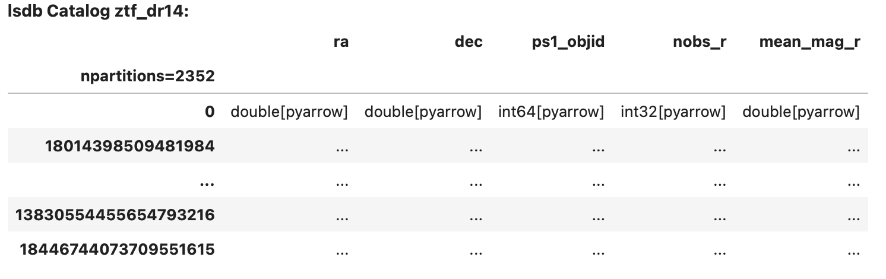
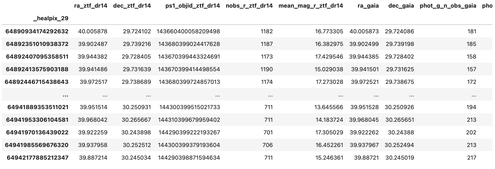

Getting Started with LSDB
==========================

Installation
--------------------------

The latest release version of LSDB is available to install with `pip <https://pypi.org/project/lsdb/>`_ or `conda <https://anaconda.org/conda-forge/lsdb/>`_.

.. code-block:: bash

    python -m pip install lsdb

.. code-block:: bash

    conda install -c conda-forge lsdb

.. hint::

    We recommend using a virtual environment. Before installing the package, create and activate a fresh
    environment. Here are some examples with different tools:

    .. tab-set::

        .. tab-item:: Conda

            .. code-block:: bash

                conda create -n lsdb_env python=3.11
                conda activate lsdb_env

        .. tab-item:: venv

            .. code-block:: bash

                python -m venv ./lsdb_env
                source ./lsdb_env/bin/activate

        .. tab-item:: pyenv

            With the pyenv-virtualenv plug-in:

            .. code-block:: bash

                pyenv virtualenv 3.11 lsdb_env
                pyenv local lsdb_env

    We recommend Python versions **>=3.9, <=3.12**.

LSDB can also be installed from source on `GitHub <https://github.com/astronomy-commons/lsdb>`_. See our
advanced installation instructions in the :doc:`contribution guide </developer/contributing>`.

.. tip::
    There are some extra dependencies that can make running LSDB in a Jupyter
    environment easier, or connecting to a variety of remote file systems.

    These can be installed with the ``full`` extra.

    .. code-block:: console

        python -m pip install 'lsdb[full]'

Quickstart
--------------------------

LSDB is built on top of `Dask DataFrame <https://docs.dask.org/en/stable/dataframe.html>`_, which allows workflows
to run in parallel on distributed environments and scale to large, out-of-memory datasets. For this to work,
Catalogs are loaded **lazily**, meaning that only the metadata is loaded at first. This way, LSDB can plan
how tasks will be executed in the future without actually doing any computation. See our :doc:`tutorials </tutorials>`
for more information.

Loading a Catalog
~~~~~~~~~~~~~~~~~~~~~~~~~~

Let's start by loading a HATS formatted Catalog into LSDB. Use the :func:`lsdb.read_hats` function to
lazy load a catalog object. We'll pass in the URL to load the Zwicky Transient Facility Data Release 14
Catalog, and specify which columns we want to use from it.

.. code-block:: python

    import lsdb
    ztf = lsdb.read_hats(
        'https://data.lsdb.io/hats/ztf_dr14/ztf_object/',
        columns=["ra", "dec", "ps1_objid", "nobs_r", "mean_mag_r"],
    )
    >> ztf

Here we can see the lazy representation of an LSDB catalog object, showing its metadata such as the column
names and their types without loading any data. The ellipses in the table act as placeholders where you would
usually see values.

.. important::

    We've specified 5 columns to load here. It's important for performance to select only the columns you need
    for your workflow. Without specifying any columns, all possible columns will be loaded when
    the workflow is executed, making everything much slower and using much more memory.

Where to get Catalogs
~~~~~~~~~~~~~~~~~~~~~~~~~~
LSDB can load any catalogs in the HATS format, locally or from remote sources. There are a number of
catalogs available publicly to use from the cloud. You can see them with their URLs to load in LSDB at our
website `data.lsdb.io <https://data.lsdb.io>`_

If you have your own data not in this format, you can import it by following the instructions in our
:doc:`importing catalogs tutorial section. </tutorials/import_catalogs>`

Performing Filters
~~~~~~~~~~~~~~~~~~~~~~~~~~

LSDB can perform spatial filters fast, taking advantage of HATS's spatial partitioning. These optimized
filters have their own methods, such as :func:`cone_search <lsdb.catalog.Catalog.cone_search>`. For the list
of these methods see the full docs for the :func:`Catalog <lsdb.catalog.Catalog>` class.

.. code-block:: python

    ztf_cone = ztf.cone_search(ra=40, dec=30, radius_arcsec=100)

Other filters on columns can be performed in the same way that you would on a pandas DataFrame.

.. code-block:: python

    ztf_filtered = ztf_cone[ztf_cone["mean_mag_r"] < 18]
    ztf_filtered = ztf_filtered.query("nobs_r > 50")

Cross Matching
~~~~~~~~~~~~~~~~~~~~~~~~~~

Now we've filtered our catalog, let's try cross-matching! We'll need to load another catalog first. For a
catalog on the right side of a cross-match, we need to make sure that we load it with a ``margin_cache`` to
get accurate results. This should be provided with the catalog by the catalog's data provider. See the
:doc:`margins tutorial section </tutorials/margins>` for more.

.. code-block:: python

    gaia = lsdb.read_hats(
        'https://data.lsdb.io/hats/gaia_dr3/gaia/',
        columns=["ra", "dec", "phot_g_n_obs", "phot_g_mean_flux", "pm"],
        margin_cache="https://data.lsdb.io/hats/gaia_dr3/gaia_10arcs/",
    )

Once we've got our other catalog, we can crossmatch the two together!

.. code-block:: python

    ztf_x_gaia = ztf_filtered.crossmatch(gaia, n_neighbors=1, radius_arcsec=3)

Computing
~~~~~~~~~~~~~~~~~~~~~~~~~~

We've now planned the crossmatch lazily, but it still hasn't been actually performed. To load the data and run
the workflow we'll call the ``compute()`` method, which will perform all the tasks and return the result as a
pandas DataFrame with all the computed values.

.. code-block:: python

    result_df = ztf_x_gaia.compute()
    >> result_df

Saving the Result
~~~~~~~~~~~~~~~~~~~~~~~~~~

For large results, it won't be possible to ``compute()`` since the full result won't be able to fit into memory.
So instead, we can run the computation and save the results directly to disk in hats format.

.. code-block:: python

    ztf_x_gaia.to_hats("./ztf_x_gaia")

This creates the following HATS Catalog on disk:

.. code-block::

    ztf_x_gaia/
    ├── Norder=4/
    │   ├── Dir=0/
    │   │   ├── Npix=57.parquet
    │   │   └── ...
    │   └── ...
    ├── _common_metadata
    ├── _metadata
    ├── properties
    └── partition_info.csv

Creation of Jupyter Kernel
--------------------------

You may want to work with LSDB on Jupyter notebooks and, therefore, you need a kernel where
our package is installed. To install a kernel for your environment, type:

.. code-block:: bash

    python -m ipykernel install --user --name lsdb_env --display-name "lsdb_kernel"

It should now be available for selection in your Jupyter dashboard!
