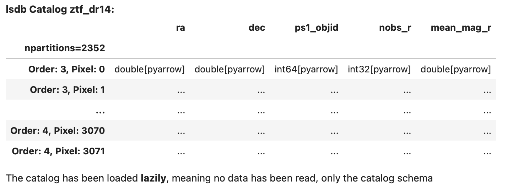

Getting Started with LSDB
==========================

Installation
--------------------------

.. hint::

    We strongly recommend using a virtual environment. Installing
    packages into your system Python can create subtle problems.

    Before installing the package, create and activate a fresh
    environment. Here are some examples with different tools:

    .. tab-set::

        .. tab-item:: conda

            .. code-block:: bash

                conda create -n lsdb_env python=3.12
                conda activate lsdb_env

        .. tab-item:: venv

            .. code-block:: bash

                python -m venv ./lsdb_env
                source ./lsdb_env/bin/activate

        .. tab-item:: pyenv

            With the pyenv-virtualenv plug-in:

            .. code-block:: bash

                pyenv virtualenv 3.12 lsdb_env
                pyenv local lsdb_env

    We recommend Python versions **>=3.10, <=3.12**.

The latest release version of LSDB is available to install with `pip <https://pypi.org/project/lsdb/>`_ or `conda <https://anaconda.org/conda-forge/lsdb/>`_.

.. code-block:: bash

    pip install lsdb

.. code-block:: bash

    conda install -c conda-forge lsdb

LSDB can also be installed from source on `GitHub <https://github.com/astronomy-commons/lsdb>`_. See our
advanced installation instructions in the :doc:`contribution guide </developer/contributing>`.

.. tip::
    There are some additional dependencies that you should install if you encounter roadblocks with the Jupyter environment or issues connecting to various remote file systems.

    These can be installed with the ``full`` extra.

    .. code-block:: console

        python -m pip install 'lsdb[full]'

Quickstart
--------------------------

LSDB is built on top of `Dask DataFrame <https://docs.dask.org/en/stable/dataframe.html>`_, which allows workflows
to run in parallel on distributed environments and scale to large, out-of-memory datasets. For this to work,
when catalogs are opened, they are loaded **lazily**, meaning that only the metadata is loaded at first. This way, LSDB can plan
how tasks will be executed in the future without actually doing any computation. See our :doc:`tutorials </tutorials>`
for more information.

Opening a Catalog
~~~~~~~~~~~~~~~~~~~~~~~~~~

Let's start by opening a HATS formatted Catalog in LSDB. Use the :func:`lsdb.open_catalog` function to
open a catalog object. We'll pass in the URL to open the Zwicky Transient Facility Data Release 14
Catalog, and specify which columns we want to use from it.

.. code-block:: python

    import lsdb
    ztf = lsdb.open_catalog(
        "https://data.lsdb.io/hats/ztf_dr14/ztf_object",
        columns=["ra", "dec", "ps1_objid", "nobs_r", "mean_mag_r"],
    )
    >> ztf

Here we can see the lazy representation of an LSDB catalog object, showing its metadata such as the column
names and their types without loading any data. The ellipses in the table act as placeholders where you would
usually see values.

.. important::

    We've specified 5 columns to load here. It's important for performance to select only the columns you need
    for your workflow. Without specifying any columns, all available columns will be loaded when
    the workflow is executed, making everything much slower and using much more memory.

    Catalogs define a set of *default columns* that are loaded if you don't specify your own list, in part
    to prevent you from incurring more I/O usage than you expected.  You can always see the full set
    of columns available with the :attr:`lsdb.catalog.Catalog.all_columns` property.

Where To Get Catalogs
~~~~~~~~~~~~~~~~~~~~~~~~~~
LSDB can open any catalogs in the HATS format, locally or from remote sources. There are a number of
catalogs available publicly to use from the cloud. You can see them with their URLs to open in LSDB at our
website `data.lsdb.io <https://data.lsdb.io>`_.

If you have your own data not in this format, you can import it by following the instructions in our
:doc:`importing catalogs tutorial section. </tutorials/import_catalogs>`

Performing Filters
~~~~~~~~~~~~~~~~~~~~~~~~~~

LSDB can perform spatial filters fast, taking advantage of HATS's spatial partitioning.  For the list of these
methods see the full docs for the :func:`Catalog <lsdb.catalog.Catalog>` class.

The best place to add filters is at the time of opening the catalog. This allows LSDB to
avoid loading unused parts of the catalog.

:func:`lsdb.open_catalog` has keyword arguments for these filters:

  * ``search_filter=`` spatial filters like :func:`lsdb.ConeSearch` and :func:`lsdb.BoxSearch`
  * ``columns=`` column filtering (as we saw earlier)
  * ``filters=`` general row-based filtering expressions

The search filter narrows the catalog to include only the regions of the catalog within the spatial
constraint. See the :doc:`region selection tutorial </tutorials/region_selection>` for more.

.. code-block:: python

    ztf_cone = lsdb.open_catalog(
        catalog_path,
        search_filter=lsdb.ConeSearch(ra=40, dec=30, radius_arcsec=1000)
    )

All operations on ``ztf_cone`` from here on out are constrained to the given spatial filter.

The ``filters=`` argument takes a list of lists, where each list is a condition, and all
conditions must be fulfilled for the row to make it past the filter. Below is a way
of filtering for ``mean_mag_r < 18 and nobs_r > 50``:

.. code-block:: python

    ztf_rows = lsdb.open_catalog(
        catalog_path,
        filters=[["mean_mag_r", "<", 18],
                 ["nobs_r", ">", 50]],

    )

You can filter the catalog after it's opened. The search filters are methods on the catalog:

.. code-block:: python

    ztf_cone = ztf.cone_search(ra=40, dec=30, radius_arcsec=1000)

The row-based filters on column values can be done in the same way that you would on a pandas DataFrame, using
:func:`lsdb.catalog.Catalog.query` or Pandas-like indexing expressions:

.. code-block:: python

    ztf_cols = ztf[["objra", "objdec", "mean_mag_r", "nobs_r"]]
    ztf_cone = ztf_cols.cone_search(ra=40, dec=30, radius_arcsec=1000)
    ztf_filtered = ztf_cone[ztf_cone["mean_mag_r"] < 18]
    ztf_filtered = ztf_filtered.query("nobs_r > 50")

Crossmatching
~~~~~~~~~~~~~~~~~~~~~~~~~~

Now we've filtered our catalog, let's try crossmatching! We'll need to open another catalog first.

.. code-block:: python

    gaia = lsdb.open_catalog(
        "https://data.lsdb.io/hats/gaia_dr3",
        columns=["ra", "dec", "phot_g_n_obs", "phot_g_mean_flux", "pm"],
    )

Once we've got our other catalog, we can crossmatch the two together!

.. code-block:: python

    ztf_x_gaia = ztf_filtered.crossmatch(gaia, n_neighbors=1, radius_arcsec=3)

As with opening the catalog, this plans but does not execute the crossmatch. See the :ref:`computing` section,
next.

.. important::

    Catalogs used on the right side of a crossmatch need to have a *margin cache* in order to get accurate
    results.  In the above example, Gaia DR3 is a catalog *collection*; opening the collection's URL
    automatically loads an appropriate margin cache. You can see what margin cache your catalog has with the
    :attr:`lsdb.catalog.Catalog.margin` property. If it exists (is not ``None``), you can inspect its name.
    In our example, this would be ``gaia.margin.name``.

    If, when calling :func:`lsdb.catalog.Catalog.crossmatch`, you get the warning ``RuntimeWarning: Right
    catalog does not have a margin cache. Results may be incomplete and/or inaccurate.``, it means that you
    should provide the margin cache directly with the ``margin_cache=`` argument. You can also use this argument
    to use a different margin cache than the collection's default.

    See :doc:`margins tutorial section </tutorials/margins>` for more.

For a detailed crossmatching example, see :doc:`the crossmatching tutorial </tutorials/pre_executed/crossmatching>`.

.. _computing:

Computing
~~~~~~~~~~~~~~~~~~~~~~~~~~

We've now planned the crossmatch lazily, but it still hasn't been actually performed. To load the data and run
the workflow we'll call the :func:`lsdb.catalog.Catalog.compute` method, which will perform all the tasks and
return the result as a ``NestedFrame`` with all the computed values. For more on ``NestedFrame`` (an extension
of the Pandas DataFrame) see the :doc:`NestedFrame tutorial section </tutorials/pre_executed/nestedframe>`.

.. code-block:: python

    result_df = ztf_x_gaia.compute()
    >> result_df

.. image:: _static/ztf_x_gaia.png
   :align: center
   :alt: The result of cross-matching our filtered ztf and gaia

Saving the Result
~~~~~~~~~~~~~~~~~~~~~~~~~~

For large results, it won't be possible to :func:`lsdb.catalog.Catalog.compute` since the full result won't be
able to fit into memory.  So instead, we can run the computation and save the results directly to disk in HATS
format.

.. code-block:: python

    ztf_x_gaia.to_hats("./ztf_x_gaia")

This creates the following HATS Catalog on disk:

.. code-block::

    ztf_x_gaia/
    ├── dataset
    │   ├── Norder=4
    │   │   └── Dir=0
    │   │       └── Npix=57.parquet
    │   ├── _common_metadata
    │   ├── _metadata
    │   └── data_thumbnail.parquet
    ├── hats.properties
    ├── partition_info.csv
    └── skymap.fits

