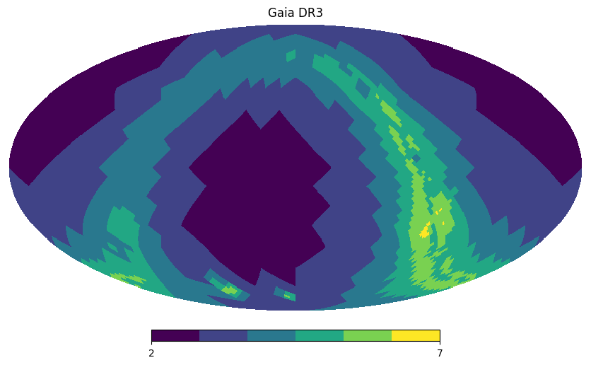

.. lsdb documentation main file.
   You can adapt this file completely to your liking, but it should at least
   contain the root `toctree` directive.

LSDB - Large Survey DataBase
========================================================================================

LSDB is a framework that facilitates and enables fast spatial analysis for extremely large astronomical catalogs
(i.e. querying and crossmatching O(1B) sources). It aims to address large-scale data processing challenges, in
particular those brought up by `LSST <https://www.lsst.org/about>`_.

Built on top of Dask to efficiently scale and parallelize operations across multiple workers, it leverages
the `HiPSCat <https://hipscat.readthedocs.io/en/stable/>`_ data format for surveys in a partitioned HEALPix
(Hierarchical Equal Area isoLatitude Pixelization) structure.

   A possible HEALPix distribution for Gaia DR3.

In this website you will find:

- Getting Started guides on how to :doc:`install <installation>` and run an :doc:`example workflow <tutorials/quickstart>`
- :doc:`Tutorials <tutorials>` with more advanced usage examples
- The detailed :doc:`API Reference <autoapi/index>` documentation

Learn more about contributing to this repository in our :doc:`Contribution Guide <developer/contributing>`.

.. toctree::
   :hidden:

   Home page <self>
   Installation <installation>
   Getting Started <tutorials/quickstart>
   Tutorials <tutorials>

.. toctree::
   :hidden:
   :caption: Developer

   API Reference <autoapi/index>
   Contribution Guide <developer/contributing>

.. toctree::
   :hidden:

   Contact us <contact>

Acknowledgements
-------------------------------------------------------------------------------

This project is supported by Schmidt Sciences.

This project is based upon work supported by the National Science Foundation
under Grant No. AST-2003196.

This project acknowledges support from the DIRAC Institute in the Department of 
Astronomy at the University of Washington. The DIRAC Institute is supported 
through generous gifts from the Charles and Lisa Simonyi Fund for Arts and 
Sciences, and the Washington Research Foundation.