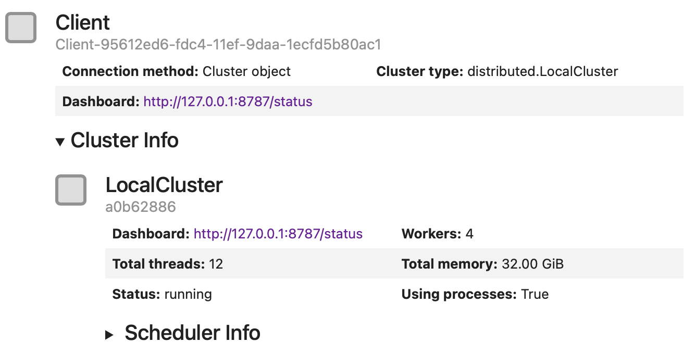
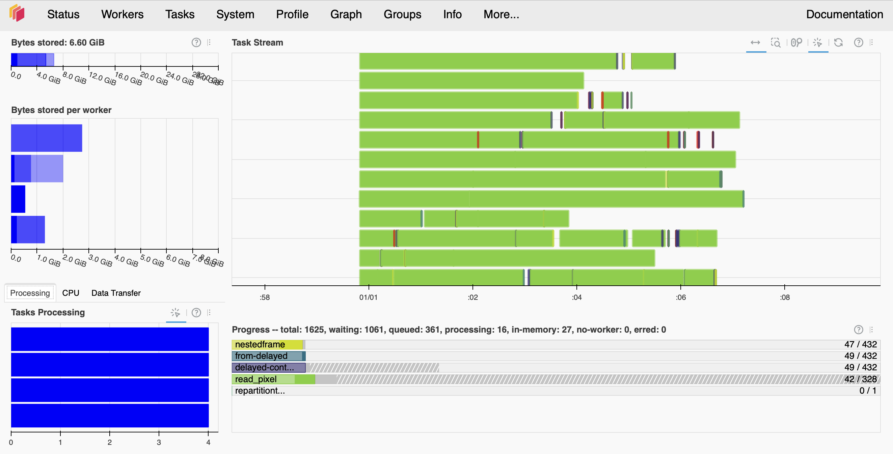
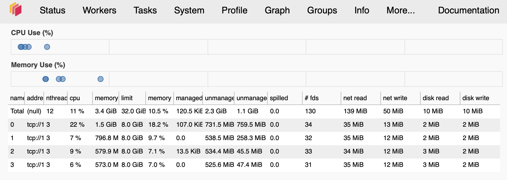

Dask cluster configuration tips
===============================

LSDB uses the `Dask <https://dask.org/>`_ framework for parallel and out-of-memory computing.
Dask is a flexible library for parallel computing in Python that scales from single machines to large clusters.
When using LSDB, it is usually worth setting up a Dask cluster (local or multi-node) to take advantage of
parallel computing.
With no Dask cluster, LSDB would use a single CPU core for the computations, which is prohibitive for large datasets.

Here, we provide some tips on how to set up a Dask cluster for LSDB computations.
Note that `Dask <https://dask.org/>`_ also provides its own
`best practices <https://docs.dask.org/en/stable/best-practices.html>`_, which may also be useful to consult.

Local Cluster on Single Machine or Node
---------------------------------------

Even on a single machine, Dask recommends using their distributed cluster.
This simple example runs a local cluster and starts a client connected to it.

.. code-block:: python

    from dask.distributed import Client
    from lsdb import read_hats, ConeSearch

    catalog = lsdb.read_hats(
        'https://data.lsdb.io/hats/gaia_dr3/gaia',
        search_filter=ConeSearch(ra=0, dec=0, radius=1),
    )
    client = Client()
    df = catalog.compute()
    client.close()

Here, ``Client()`` would create and start a `LocalCluster <https://distributed.dask.org/en/stable/api.html#distributed.LocalCluster>`_,
and initialize a client session connected to it.
When no parameters are provided, Dask would typically allocate multiple workers, and set number of Python threads and
memory limit to match your machine configuration.
As you run more computationally intensive graphs, you will want to consider configuring the cluster
to better distribute your machine's resources.

Setting workers and threads
...........................

Usually the client initialization would look like this:

.. code-block:: python

    from dask.distributed import Client

    # Create a local cluster and connect to it
    client = Client(
        # Number of Dask workers - Python processes to run
        n_workers=16,
        # Limits number of Python threads per worker
        threads_per_worker=2,
        # Memory limit, per worker, which here is also 10 GB per worker thread
        memory_limit="20GB",
    )
    client

In general, increasing the number of workers executing tasks in your graph in parallel is more beneficial
than increasing the number of threads available for each worker.
In your cluster configuration, it is preferable to increase the number of workers (``n_workers``) while
keeping ``threads_per_worker`` small (e.g., 1 or 2 threads per worker).

The ``threads_per_worker`` parameter determines the number of Dask tasks each worker can process concurrently.
Larger values may lead to higher memory consumption.
Despite its name, ``threads_per_worker`` does not limit the number of CPU cores a worker can use
but instead sets the number of Python threads the worker runs.

The number of Python threads is a trade-off between minimizing inter-worker data transfer and improving
parallel processing efficiency.
We recommend keeping ``threads_per_worker`` small because LSDB pipelines typically do not transfer data frequently,
and using a larger number of Python threads may increase
`Global Interpreter Lock <https://wiki.python.org/moin/GlobalInterpreterLock>`_ (GIL) contention.
Additionally, the underlying LSDB (e.g., Parquet reading) and user code may utilize more than one CPU
core per Python thread.

Setting memory limits
.....................

In terms of RAM allocation for each worker, we have found that returns diminish past 10 GB per each thread
allocated to that worker when processing LSDB workloads.
Usage of ``lsdb.read_hats(columns=..., filters=...)`` may make the memory footprint much smaller, which would
allow you to allocate less memory per worker, and thus use more workers and make the analysis run faster.

When executing custom code/functions through LSDB's interface, keep in mind that any intermediate products
created in that function affect the memory footprint of the overall workflow. For example, in the below
example our code copies a dataframe input effectively doubling the amount of input memory. Being aware of
the memory performance of your analysis code is highly encouraged for general LSDB/Dask performance, and
memory allocation may need to be increased accordingly.

.. code-block:: python

    def my_func(df):
        df2 = df.copy()
        return df2.query("a>5")

    new_catalog = catalog.map_partitions(my_func)

Multiple Node Cluster
---------------------

With multiple nodes, you would usually have a scheduler running on one node and Dask workers being distributed across the nodes.
In this case each computational node would run one or more Dask workers,
while each worker may take few Dask tasks (usually one per LSDB partition) and use multiple threads.

Please see the `Dask <https://docs.dask.org/en/stable/deploying.html>`_
and `dask-jobqueue <https://jobqueue.dask.org/en/latest/>`_ documentation for more details
about how to run Dask on multiple nodes.

High-Performance Computing Cluster with SLURM
.............................................

The Dask ecosystem has a `dask-jobqueue <https://jobqueue.dask.org/en/latest/>`_ package that allows users to run Dask on HPC clusters.
It provides a way to submit Dask workers as SLURM jobs, and to scale the number of workers dynamically.
Unfortunately, ``dask-jobqueue`` does not support selecting both the number of SLURM job cores
and Dask threads per worker separately.
We found it may be a problem for some SLURM clusters that require to specify the exact number of cores and memory per job.

The following configuration is an example that was run on `Pittsburgh Supercomputing Center <https://www.psc.edu/>`_,
and contains some specific settings useful for the hardware of that cluster.
This configuration runs 60 SLURM jobs, each with a single Dask worker (``processes`` variable below),
and each worker uses 3 threads (``worker_process_threads`` variable below).
On this particular SLURM queue (sometimes called "partition" or "allocation") each node has 2GB of RAM per core,
so we ask for 32GB of RAM and 16 cores per job.

.. code-block:: python

    class Job(dask_jobqueue.slurm.SLURMJob):
        # Rewrite the default, which is a property equal to cores/processes
        worker_process_threads = 3

    class Cluster(dask_jobqueue.SLURMCluster):
        job_cls = Job

    gb_per_job = 32
    jobs = 60
    processes = 1  # Single dask worker per slurm job
    gb_per_core = 2  # PSC "regular memory" nodes provide fixed 2GB / core
    cluster = Cluster(
        # Number of Dask workers per node
        processes=processes,
        # Regular memory node type on PSC bridges2
        queue="RM-shared",
        # dask_jobqueue requires cores and memory to be specified
        # We set them to match RM specs
        cores=gb_per_job // gb_per_core,
        memory=f"{gb_per_job}GB",
        # Maximum walltime for the job, 6 hours.
        # SLURM will kill the job if it runs longer
        walltime="6:00:00",
    )

    # Run multiple jobs
    cluster.scale(jobs=jobs)

    # Alternatively to cluster.scale, can use adapt to run more jobs
    # cluster.adapt(maximum_jobs=100)

    client = dask.distributed.Client(cluster)

    # Your code, running catalog.compute() or catalog.to_hats()
    # df = catalog.compute()

    # Stop the cluster, it would ask SLURM to shut all the jobs down
    cluster.close()
    # Close the client
    client.close()

So this configuration would allocate 60 SLURM jobs, with 60 Dask workers, which would create 180 Python threads,
run on 960 CPU cores, and use 1920 GB of RAM in total.
As you see, the number of CPU cores is significantly larger than the number of Python threads.
This is a trick we use to get more RAM per each task, which is crucial for LSDB pipelines.
As was mentioned earlier, LSDB pipelines may still utilize multiple CPU cores per a single Python thread,
thanks to internal multithreading of underlying libraries, such as NumPy and PyArrow.

Dask Dashboard
--------------

Dask output logs and the Dask Dashboard are both great ways to monitor and debug the pipeline.
The dashboard is run automatically by Dask.
Typically, the dashboard would be accessible at `<http://127.0.0.1:8787/status>`_, but if port 8787 is already in use,
Dask will automatically choose a different port.

Here is how you can get the Dashboard link using the `Client` object:

.. code-block:: python

    client = Client(n_workers=4, threads_per_worker=1)
    print(client.dashboard_link)

In a Jupyter Notebook you can also display the client object, by making it the last line of your code
or using the `display` function:

.. code-block:: python

    client = Client(n_workers=4, threads_per_worker=1)
    display(client)

The Dashboard shows a lot of useful information, such as task progress (bar-charts on the right-hand side),
number of tasks per worker (bottom left) and memory usage (top and center left).

If you see that memory bars are colored red, it means that the workers are running out of memory.

The **Workers** page shows the status of each worker, including their memory, CPU, and network usage.

If you see that the total number of workers is less than the number of workers you requested,
it means that the workers were killed or died.
This may happen if workers overused their memory limit or, in multiple-node clusters, because of network issues.
Increasing the memory limit and network timeouts may help keep workers alive.

Receipts for Frequent Problems
------------------------------

All workers are being killed in the beginning
.............................................

If you see that the pipeline failed fast after it started, it may be due to a bug in the code, data access issues,
or memory overflow.
For the first two cases, you would see the appropriate error messages in the logs.
If the message doesn't contain enough useful information, you can try to run the pipeline with no ``Client`` object
being created.
In this case, Dask will use the default scheduler, which will run tasks on the same Python process and give you
a usual Python traceback on the failure.

In the case of the memory overflow, Dask Dashboard will show red bars in the memory usage chart,
and logs will show messages like the following:

.. code-block:: text

   distributed.nanny.memory - WARNING - Worker tcp://127.0.0.1:49477 (pid=59029) exceeded 95% memory budget. Restarting...
   distributed.nanny - WARNING - Restarting worker
   KilledWorker: Attempted to run task ('read_pixel-_to_string_dtype-nestedframe-0c9d20582a6d2703d02a4835dddb05d2', 30904) on 4 different workers, but all those workers died while running it. The last worker that attempt to run the task was tcp://127.0.0.1:50761. Inspecting worker logs is often a good next step to diagnose what went wrong. For more information see https://distributed.dask.org/en/stable/killed.html.

You can solve this issue by increasing the memory limit per worker, which would usually mean
that you also need to reduce the number of workers.
If that is not possible, you can also try to reduce the amount of data loaded into memory per partition,
for example, by specifying which columns to use when loading data with ``lsdb.read_hats(columns=...)``.

All workers are being killed in the middle/end
..............................................

Some workflows can have a very unbalanced memory load,
so just one or few tasks would use much more memory than others.
You can diagnose this by looking at the memory usage chart in Dask Dashboard,
it would show that only one worker is using much more memory than others.
In such cases you may set the total memory limit ``memory_limit * n_workers`` larger than the actual amount of
memory on your system.
For example, if you have 16GB of RAM and you see that almost all of the tasks need 1GB, while a single
task needs 8GB, you can start a cluster with this command:

.. code-block:: python

    from dask.distributed import Client
    client = Client(n_workers=8, memory_limit='8GB', threads_per_worker=1)

This approach can also help to speed up the computations, because it enables running with more workers.

I run ``.compute()``, but the Dask Dashboard is empty for a long time
....................................................................

For large tasks, such as cross-matching or joining multiple dozen-terabyte scale catalogs,
Dask may spend a lot of time and memory of the main process before any computation starts.
This happens because Dask builds and optimizes the computation graph, which happens
on the main process (one you create ``Client`` on).
There is no single solution to this problem, but you can try to reduce the number of partitions in use,
for example, by specifying limiting the area when loading data,
with ``lsdb.read_hats(search_filter=lsdb.ConeSearch(...))``.
