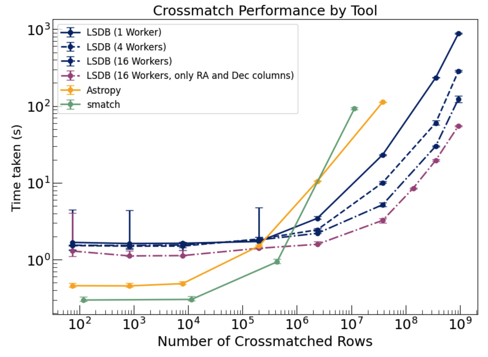

Performance
===========

LSDB is a high-performance package built to support the analysis of large-scale astronomical datasets.
One of the performance goals of LSDB is to add as little overhead over the input-output operations as possible.
We achieve this for catalog cross-matching and spatial- and data-filtering operations by using
the `HATS <https://github.com/astronomy-commons/hats>`_ data format,
efficient algorithms,
and `Dask <https://dask.org/>`_ framework for parallel computing.

Here, we demonstrate the results of LSDB performance tests for cross-matching operations,
performed on the `Bridges2 cluster at Pittsburgh Supercomputing Center <https://www.psc.edu/resources/bridges-2/>`_ 
using a single node with 128 cores and 256 GB of memory.

Cross-matching performance overhead
-----------------------------------

We compare I/O speed and cross-matching performance of LSDB on an example cross-matching of
ZTF DR14 (metadata only, 1.2B rows, 60GB)
and Gaia DR3 (1.8B rows, 972GB) catalogs.

The cross-matching took 46 minutes and produced a catalog of 498GB.
LSDB would read more data than it would write in this case, so to get a lower boundary estimate, we use the output size, which gives us 185MB/s as the cross-matching speed.

We compare this to just copying both catalogs with ``cp -r`` command, which took 86 minutes and produced 1030GB of data,
which corresponds to 204MB/s as the copy speed.

These allow us to conclude that LSDB cross-matching overhead is 5-15% compared to the I/O operations.

The details of this analysis are given in
`this note <https://github.com/lincc-frameworks/notebooks_lf/blob/ac5f91e3100aeaff5a5028b357dce08489dcab5b/sprints/2024/02_22/banch-vs-cp.md>`_.

LSDB's cross-matching algorithm performance versus other tools
--------------------------------------------------------------

We compare the performance of LSDB's default cross-matching algorithm with
astropy's `match_coordinates_sky <https://docs.astropy.org/en/stable/api/astropy.coordinates.match_coordinates_sky.html>`_
and `smatch <https://github.com/esheldon/smatch>`_ package.
All three approaches use scipy's k-D tree implementation to find the nearest neighbor on a 3-D unit sphere.

We use the same ZTF DR14 and Gaia DR3 catalogs as in the previous test, but we only use coordinate columns for the cross-matching.
With each algorithm, we perform the cross-matching of the catalogs within a 1 arcsecond radius, selecting the closest match.
To compare the performance on different scales,
we select subsets of the catalogs with a cone search around an arbitrary point,
increasing the radius from 1 arcminute to 25 degrees.

The analysis has the following steps:

* Load the data from the HATS format, selecting the subset of the data with ``lsdb.read_hats(PATH, columns=[RA_COL, DEC_COL]).cone_search(ra, dec, radius).compute()``.
* Perform the cross-matching with the selected algorithm

  * LSDB: ``ztf.crossmatch(gaia, radius_arcsec=1, n_neighbors=1).compute()``
  * Astropy analysis is two-step:

    * Initialize the ``SkyCoord`` objects for both catalogs
    * Perform the cross-matching with ``match_coordinates_sky(ztf, gaia, nthneighbor=1)``, filter the results by 1-arcsencod radius, and compute distances

  * Smatch: ``smatch.match(ztf_ra, ztf_dec, 1/3600, gaia_ra, gaia_dec)``, and convert distances from cosines of the angles to arcseconds

The results of the analysis are shown in the following plot:

Some observations from the plot:

* Construction of the ``SkyCoord`` objects in astropy is the most time-consuming step; in this step, spherical coordinates are converted to Cartesian, so ``match_coordinates_sky()`` has less work to do compared to other algorithms. So if your analysis doesn't require the ``SkyCoord`` objects anywhere else, it would be more fair to add up the time of the ``SkyCoord`` objects construction and the ``match_coordinates_sky()`` execution.
* All algorithms but LSDB have a nearly linear dependency on the number of rows in the input catalogs starting from a small number of rows. LSDB has a constant overhead associated with the graph construction and Dask overhead, which is negligible for large catalogs, where the time starts to grow linearly.
* LSDB is the only method allowing users to parallelize the cross-matching operation, so we run it with 1, 4, 16, and 64 workers.
* 16 and 64-worker cases show the same performance, which demonstrates the limits of the parallelization, at least with the hardware setup used in the analysis.
* Despite the fact that LSDB's crossmatching algorithm does similar work converting spherical coordinates to Cartesian, it's getting faster than astropy's algorithm for larger catalogs, even with a single worker. This is probably due to the fact that LSDB utilises a batching approach, which constructs shallower k-D trees for each partition of the data, and thus less time is spent on the tree traversal.

Summarizing, the cross-matching approach implemented in LSDB is competitive with the existing tools and is more efficient for large catalogs, starting with roughly one million rows.
Also, LSDB enables the use of out-of-memory datasets, which is not possible with astropy and smatch, and not demonstrated in the analysis.

The complete code of the analysis is available `here <https://github.com/lincc-frameworks/notebooks_lf/tree/main/sprints/2024/05_30/xmatch_bench>`_.
